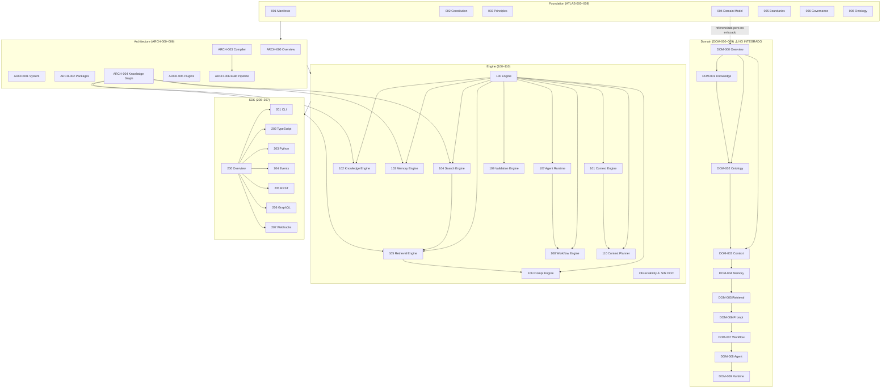

# Informe de Revisión Arquitectónica — Atlas Documentation

**Alcance:** 46 documentos en `Foundation/` (10), `Architecture/` (7), `Domain/` (10), `Engine/` (11), `SDK/` (8)  
**Fecha de revisión:** 17 de julio de 2026  
**Modo:** Solo lectura — sin cambios aplicados al corpus analizado

---

## 1. Resumen ejecutivo

La documentación de Atlas tiene una **estructura conceptual sólida** (Foundation → Architecture → Engine → SDK) y una **numeración canónica emergente** visible en `ATLAS-ARCH-000`, los documentos Engine 104–109 y los SDK 201–204 actuales. Sin embargo, el corpus presenta **deuda documental significativa**: múltiples capas fueron renumeradas o redefinidas sin actualizar todas las referencias cruzadas.

Los problemas más graves son:

| Severidad | Problema | Impacto |
|-----------|----------|---------|
| **Crítica** | Dos modelos de dominio paralelos sin puente explícito | Ambigüedad semántica en todo el ecosistema |
| **Crítica** | Renumeración incompleta de Engine (101–110) | Referencias cruzadas incorrectas en ~15 documentos |
| **Alta** | `ATLAS-DOM-000` lista dominios con IDs permutados | Mapa de dominio oficial inconsistente con archivos reales |
| **Alta** | SDK 201–204: registros vs. archivos no coinciden | Integradores no saben qué SDK existe |
| **Media** | Ontología duplicada (Foundation vs. Domain) | Riesgo de definiciones divergentes |
| **Media** | Módulo Observability referenciado pero no documentado | Componente arquitectónico huérfano |

**Veredicto:** La arquitectura es coherente en su visión (Knowledge First, Graph Native, Compiler Driven), pero **no es coherente en su indexación y referencias**. Antes de implementar código, conviene una pasada de alineación documental.

---

## 2. Inventario por capa

### 2.1 Foundation (ATLAS-000 → ATLAS-009)

Modelo organizacional: Organization, Brand, Strategy, Capability, Knowledge, Workflow, Agent, etc.

| ID | Archivo | Estado |
|----|---------|--------|
| ATLAS-000 | README | `active` |
| ATLAS-001 | Manifesto | `active` |
| ATLAS-002 | Constitution | `active` |
| ATLAS-003 | Principles | `draft` |
| ATLAS-004 | Domain Model | `draft` |
| ATLAS-005 | Boundaries | `draft` |
| ATLAS-006 | Governance | `draft` |
| ATLAS-007 | Decision Model | `draft` |
| ATLAS-008 | Ontology | `draft` |
| ATLAS-009 | Glossary | `draft` |

### 2.2 Architecture (ATLAS-ARCH-000 → 006)

Capas de software: Kernel, Compiler, Knowledge Graph, Plugins, Build Pipeline.

| ID | Archivo |
|----|---------|
| ATLAS-ARCH-000 | Architecture Overview |
| ATLAS-ARCH-001 | System Architecture |
| ATLAS-ARCH-002 | Package Architecture |
| ATLAS-ARCH-003 | Compiler Architecture |
| ATLAS-ARCH-004 | Knowledge Graph Architecture |
| ATLAS-ARCH-005 | Plugin Architecture |
| ATLAS-ARCH-006 | Build & Compilation Pipeline |

### 2.3 Domain (ATLAS-DOM-000 → 009)

Modelo técnico/plataforma: Knowledge, Ontology, Context, Memory, Retrieval, Prompt, Workflow, Agent, Runtime.

| ID | Archivo |
|----|---------|
| ATLAS-DOM-000 | Domain Overview |
| ATLAS-DOM-001 | Knowledge Domain |
| ATLAS-DOM-002 | Ontology Domain |
| ATLAS-DOM-003 | Context Domain |
| ATLAS-DOM-004 | Memory Domain |
| ATLAS-DOM-005 | Retrieval Domain |
| ATLAS-DOM-006 | Prompt Domain |
| ATLAS-DOM-007 | Workflow Domain |
| ATLAS-DOM-008 | Agent Domain |
| ATLAS-DOM-009 | Runtime Domain |

### 2.4 Engine (ATLAS-100 → 110)

Módulos de ejecución operativa.

| ID | Archivo |
|----|---------|
| ATLAS-100 | Engine (overview) |
| ATLAS-101 | Context Engine |
| ATLAS-102 | Knowledge Engine |
| ATLAS-103 | Memory Engine |
| ATLAS-104 | Search Engine |
| ATLAS-105 | Retrieval Engine |
| ATLAS-106 | Prompt Engine |
| ATLAS-107 | Agent Runtime |
| ATLAS-108 | Workflow Engine |
| ATLAS-109 | Validation Engine |
| ATLAS-110 | Context Planner |

### 2.5 SDK (ATLAS-200 → 207)

Contratos de integración externa.

| ID | Archivo |
|----|---------|
| ATLAS-200 | SDK Overview |
| ATLAS-201 | SDK CLI |
| ATLAS-202 | SDK TypeScript |
| ATLAS-203 | SDK Python |
| ATLAS-204 | SDK Events |
| ATLAS-205 | REST API |
| ATLAS-206 | GraphQL API |
| ATLAS-207 | Webhooks |

---

## 3. Mapa de dependencias entre documentos

### 3.1 Jerarquía conceptual oficial (según `ATLAS-ARCH-000`)



### 3.2 Grafo de dependencias de dominio técnico (canónico en archivos)

```text
Knowledge (DOM-001)
    └── Ontology (DOM-002)
            └── Context (DOM-003)
                    └── Memory (DOM-004)
                            └── Retrieval (DOM-005)
                                    └── Prompt (DOM-006)
                                            └── Workflow (DOM-007)
                                                    └── Agent (DOM-008)
                                                            └── Runtime (DOM-009)
```

### 3.3 Pipeline de ejecución Engine (canónico en 104–110)

```text
Request
  → Context Planner (110)
  → Context Engine (101)
  → Search Engine (104) → Retrieval Engine (105)
  → Prompt Engine (106)
  → Agent Runtime (107) ← Workflow Engine (108)
  → Validation Engine (109)
  → [Observability — sin documento]
```

### 3.4 Matriz de referencias cruzadas entre capas

| Desde → Hacia | Foundation | Architecture | Domain | Engine | SDK |
|---------------|:----------:|:------------:|:------:|:------:|:---:|
| **Foundation** | ✓ interno | ✗ | ✗ | ✗ | ✗ |
| **Architecture** | ✓ (000, 001) | ✓ interno | ✗ | ✓ parcial | ✓ parcial |
| **Domain** | ✗ (salvo mención en DOM-002) | ✓ parcial | ✓ interno | ✓ **con errores** | ✗ |
| **Engine** | ✓ completo | ✗ | ✗ | ✓ **con errores** | ✗ |
| **SDK** | ✓ completo | ✓ parcial | ✓ parcial (201–204) | ✓ (205–207) | ✓ interno **con errores** |

**Hallazgo clave:** La carpeta `Domain/` es una capa completa que **no aparece en el orden de lectura oficial** (`ARCH-000` §7) ni está referenciada desde Foundation. Es un silo documental.

---

## 4. Referencias rotas

### 4.1 ID inexistente en el repositorio

| Referencia | Ubicación | Problema |
|------------|-----------|----------|
| `ATLAS-COMPILER-001` | `SDK/ATLAS-201-SDK_CLI.md` | No existe documento con ese ID |
| `Template Engine` (como ATLAS-102) | `Domain/ATLAS-DOM-006-PROMPT_DOMAIN.md` | ATLAS-102 es **Knowledge Engine**, no Template Engine |
| `Observability` (como ATLAS-109) | `Engine/ATLAS-100`, `101`, `102`, `103`, `110` | ATLAS-109 es **Validation Engine**; no hay doc de Observability |
| `Java SDK` (ATLAS-203) | `SDK/ATLAS-200`, `ATLAS-205` | ATLAS-203 es **SDK Python** |
| `.NET SDK` (ATLAS-204) | `SDK/ATLAS-200`, `ATLAS-205` | ATLAS-204 es **SDK Events** |

### 4.2 Referencias con ID correcto pero etiqueta incorrecta

Estas referencias apuntan a un ID que existe, pero **nombran un componente distinto** al del archivo real:

| Documento fuente | Referencia escrita | Realidad en archivo |
|------------------|-------------------|---------------------|
| `ATLAS-100-ENGINE.md` §17 | 101 = Knowledge Engine | `ATLAS-101` = **Context Engine** |
| `ATLAS-100-ENGINE.md` §17 | 102 = Agent Runtime | `ATLAS-102` = **Knowledge Engine** |
| `ATLAS-100-ENGINE.md` §17 | 103 = Context Engine | `ATLAS-103` = **Memory Engine** |
| `ATLAS-100-ENGINE.md` §17 | 104 = Memory Engine | `ATLAS-104` = **Search Engine** |
| `ATLAS-100-ENGINE.md` §17 | 105 = Workflow Engine | `ATLAS-105` = **Retrieval Engine** |
| `ATLAS-100-ENGINE.md` §17 | 106 = Search Engine | `ATLAS-106` = **Prompt Engine** |
| `ATLAS-100-ENGINE.md` §17 | 107 = Validation Engine | `ATLAS-107` = **Agent Runtime** |
| `ATLAS-100-ENGINE.md` §17 | 108 = Prompt Engine | `ATLAS-108` = **Workflow Engine** |
| `ATLAS-100-ENGINE.md` §17 | 109 = Observability | `ATLAS-109` = **Validation Engine** |
| `ATLAS-DOM-000` §16 | DOM-004 = Agent Domain | `ATLAS-DOM-004` = **Memory Domain** |
| `ATLAS-DOM-000` §16 | DOM-005 = Workflow Domain | `ATLAS-DOM-005` = **Retrieval Domain** |
| `ATLAS-DOM-000` §16 | DOM-007 = Memory Domain | `ATLAS-DOM-007` = **Workflow Domain** |
| `ATLAS-DOM-000` §16 | DOM-008 = Retrieval Domain | `ATLAS-DOM-008` = **Agent Domain** |
| `ATLAS-DOM-003` §30 | 104 = Context Engine | `ATLAS-104` = **Search Engine** |
| `ATLAS-DOM-006` §31 | 101 = Prompt Engine | `ATLAS-101` = **Context Engine** |
| `ATLAS-DOM-008`, `009` §31 | 101 = Prompt Engine | `ATLAS-101` = **Context Engine** |
| `ATLAS-DOM-008`, `009` §31 | 110 = Agent Runtime | `ATLAS-110` = **Context Planner** |

### 4.3 Esquema Engine obsoleto en documentos legacy

Los documentos `ATLAS-101`, `102`, `103`, `110` contienen secciones "Related Documents" con un **esquema de 9 módulos** (sin Retrieval ni Context Planner) donde los IDs 105–109 están desplazados:

```text
Esquema LEGACY (101, 102, 103, 110):
  105 = Prompt Engine     →  REAL: Retrieval Engine
  106 = Agent Runtime     →  REAL: Prompt Engine
  107 = Workflow Engine   →  REAL: Agent Runtime
  108 = Validation Engine →  REAL: Workflow Engine
  109 = Observability     →  REAL: Validation Engine
```

### 4.4 Estructura de proyecto obsoleta

`Foundation/ATLAS-000-README.md` describe una estructura `core/`, `docs/`, `adr/` que **no coincide** con la estructura actual (`Foundation/`, `Architecture/`, `Domain/`, etc.).

---

## 5. Contradicciones

### 5.1 Dos "Domain Models" sin relación explícita

| Aspecto | Foundation `ATLAS-004` | Domain `ATLAS-DOM-000` |
|---------|------------------------|------------------------|
| **Enfoque** | Organizaciones humanas | Plataforma de software |
| **Entidades** | Organization, Brand, Strategy, Process | Knowledge, Ontology, Context, Memory |
| **Workflow** | Ejecución de un Process organizacional | Dominio técnico de orquestación |
| **Agent** | Capacidad inteligente (humano/IA/híbrido) | Entidad de ejecución en Runtime |
| **Knowledge** | Documentación, playbooks, decisiones | KnowledgeNode, Knowledge Graph, compilación |

Ambos usan el término **"Domain Model"** como definición oficial. No hay documento puente que explique cómo se mapean (p. ej., Process organizacional → Workflow Domain → Workflow Engine).

**Contradicción con ATLAS-004:** El propio Foundation dice *"Atlas does not model software"* y *"Atlas models organizations"*, mientras la carpeta `Domain/` modela exclusivamente software.

### 5.2 Dos ontologías

| | `Foundation/ATLAS-008` | `Domain/ATLAS-DOM-002` |
|--|------------------------|------------------------|
| **Entidades** | Organization, Brand, Strategy, Agent, Asset | Knowledge Entity, Agent, Workflow, Prompt, Workspace |
| **Namespace** | No definido | Foundation, Architecture, Domain, SDK, Runtime |
| **Relaciones** | Organizacionales | Semánticas del Knowledge Graph |

`DOM-002` menciona un namespace "Foundation" pero **no referencia `ATLAS-008`**. Riesgo de reglas semánticas divergentes (p. ej., "Agent" tiene significados distintos).

### 5.3 Search Engine vs. Retrieval Engine

- **`ATLAS-100`** (cuerpo): lista un único módulo "Search Engine" responsable de "Recuperación semántica".
- **`ATLAS-104`** y **`ATLAS-105`**: separan claramente descubrimiento (Search) de evaluación/selección (Retrieval).
- **`ATLAS-ARCH-004`**: referencia ambos como componentes distintos del Knowledge Graph.

La versión canónica es la separación 104/105; `ATLAS-100` refleja un diseño anterior.

### 5.4 Context Engine vs. Context Planner

- **`ATLAS-110`**: Context Planner es subcomponente estratégico del Context Engine.
- **`ATLAS-100`**: no menciona Context Planner ni ATLAS-110.
- **`ATLAS-101`**: Related Documents no incluye ATLAS-110.

Relación padre-hijo definida en 110 pero no propagada al índice maestro.

### 5.5 Principios en README vs. ATLAS-003

`ATLAS-000-README` lista 7 principios simplificados ("Explicit Knowledge").  
`ATLAS-003` define **15 principios** con nombres distintos ("Explicit Over Implicit", "Single Source of Truth", etc.).

No es una contradicción lógica, pero sí **inconsistencia de índice** que puede confundir lectores.

### 5.6 Numeración SDK: lenguajes vs. interfaces

| ID | Según `ATLAS-200` / `ATLAS-205` | Archivo real |
|----|--------------------------------|--------------|
| 201 | Python SDK | **SDK CLI** |
| 202 | TypeScript SDK | TypeScript SDK ✓ |
| 203 | Java SDK | **SDK Python** |
| 204 | .NET SDK | **SDK Events** |

`ATLAS-201-SDK_CLI`, `ATLAS-203-SDK_PYTHON`, `ATLAS-204-SDK_EVENTS` tienen IDs y contenido alineados entre sí, pero **desalineados** con el Overview y REST API.

---

## 6. Duplicados y solapamientos

### 6.1 Contenido duplicado

| Tema | Documentos | Observación |
|------|------------|-------------|
| Domain Model | `ATLAS-004`, `ATLAS-DOM-000` | Dos definiciones "oficiales" paralelas |
| Ontology | `ATLAS-008`, `ATLAS-DOM-002` | Mismo concepto, vocabularios distintos |
| Domain dependency chain | `ATLAS-DOM-000` §20, `ATLAS-DOM-001` §29 | Mismo grafo repetido |
| Engine architecture diagram | `ATLAS-100` §4, §15 | Diagrama casi idéntico duplicado internamente |
| Final Statement | `ATLAS-DOM-000` | Dos "Final Statement" (§17 y §32) |

### 6.2 Responsabilidades solapadas

| Concepto A | Concepto B | Solapamiento |
|------------|------------|--------------|
| Search Engine (104) | Retrieval Engine (105) | Resuelto en docs 104/105, no en ATLAS-100 |
| Context Engine (101) | Context Planner (110) | Jerarquía clara en 110, ambigua en índices |
| Knowledge Engine (102) | Knowledge Domain (DOM-001) | Misma responsabilidad, capas distintas sin mapeo |
| Observability (módulo) | Domain Observability (DOM-000 §31) | Capacidad transversal sin dueño documental |
| Workflow (Foundation Process→Workflow) | Workflow Domain + Engine | Tres niveles de "workflow" sin glosario unificado |

---

## 7. Conceptos inconsistentes

### 7.1 Tabla de alineación Engine — estado actual

| ID | **Canónico** (archivo + ARCH-000 + 104–109) | **Legacy** (100, 101–103, 110) | **Domain refs erróneas** |
|----|---------------------------------------------|-------------------------------|------------------------|
| 101 | Context Engine | Knowledge Engine | Prompt Engine (DOM-006, 008, 009) |
| 102 | Knowledge Engine | Agent Runtime | Template Engine (DOM-006) |
| 103 | Memory Engine | Context Engine | — |
| 104 | Search Engine | Memory Engine | Context Engine (DOM-003) |
| 105 | Retrieval Engine | Workflow Engine | — |
| 106 | Prompt Engine | Search Engine | — |
| 107 | Agent Runtime | Validation Engine | — |
| 108 | Workflow Engine | Prompt Engine | — |
| 109 | Validation Engine | Observability | — |
| 110 | Context Planner | *(ausente)* | Agent Runtime (DOM-008, 009) |

### 7.2 Tabla de alineación Domain — estado actual

| ID | **Canónico** (archivo) | **DOM-000 §16** |
|----|------------------------|-----------------|
| DOM-004 | Memory | Agent |
| DOM-005 | Retrieval | Workflow |
| DOM-006 | Prompt | Prompt ✓ |
| DOM-007 | Workflow | Memory |
| DOM-008 | Agent | Retrieval |
| DOM-009 | Runtime | *(ausente)* |

### 7.3 Terminología "Workflow" en tres niveles

1. **Foundation:** Workflow = ejecución concreta de un Process organizacional
2. **Domain:** Workflow = dominio DDD con entidades, aggregates, events
3. **Engine:** Workflow Engine = orquestador de agentes y tareas

Sin glosario que distinga `Organizational Workflow` vs. `Platform Workflow`.

### 7.4 "Agent" en tres niveles

1. **Foundation ATLAS-004:** Agent = capacidad inteligente bajo políticas, sin autoridad propia
2. **Domain ATLAS-DOM-008:** Agent = entidad de dominio con runtime model, lifecycle
3. **Engine ATLAS-107:** Agent Runtime = entorno de ejecución con proveedores LLM

Coherente conceptualmente, pero **sin documento de mapeo explícito**.

---

## 8. Problemas de gobernanza y metadatos

| Problema | Detalle |
|----------|---------|
| **Estados inconsistentes** | Solo Manifesto, Constitution y README están `active`; todo lo demás `draft` incluyendo Principles y Domain Model |
| **Nombres de archivo irregulares** | `ATLAS-003—PRINCIPLES.md` (em dash), `ATLAS-ARCH-002 — PACKAGE_ARCHITECTURE.md` (espacios/em dash) |
| **Fechas** | Foundation jul-12/13; Architecture/Domain jul-16; Engine/SDK jul-13 — sugiere oleadas de escritura sin sincronización |
| **Owner divergente** | Foundation Board vs. Architecture Board vs. Domain Board vs. Core Team |
| **Carpeta Domain ausente del índice maestro** | ARCH-000 §5 lista Foundation, Architecture, Engine, SDK, Apps — **no Domain** |
| **ATLAS-004 referenciado como Domain Model único** | SDK y Engine apuntan a ATLAS-004, ignorando ATLAS-DOM-* |

---

## 9. Documentos con referencias correctas (referencia canónica)

Estos documentos tienen el esquema Engine/SDK **alineado con los archivos reales** y pueden servir como **fuente de verdad** para una futura corrección:

- `Architecture/ATLAS-ARCH-000-ARCHITECTURE_OVERVIEW.md`
- `Engine/ATLAS-104-SEARCH_ENGINE.md` through `ATLAS-109-VALIDATION_ENGINE.md`
- `SDK/ATLAS-201-SDK_CLI.md`, `ATLAS-202-SDK_TYPESCRIPT.md`, `ATLAS-203-SDK_PYTHON.md`, `ATLAS-204-SDK_EVENTS.md` (referencias cruzadas entre sí)
- `SDK/ATLAS-205-REST_API.md`, `ATLAS-206-GRAPHQL_API.md`, `ATLAS-207-WEBHOOKS.md` (referencias Engine correctas; SDK 201–204 incorrectas en 205)

---

## 10. Recomendaciones priorizadas

### Prioridad 1 — Establecer fuente de verdad

1. Declarar en un índice maestro cuál es el **Domain Model oficial** para cada capa (organizacional vs. plataforma).
2. Fijar la numeración Engine 101–110 según `ARCH-000` como **canónica**.
3. Fijar SDK 201=CLI, 202=TS, 203=Python, 204=Events como **canónico**.

### Prioridad 2 — Corregir referencias

4. Actualizar `ATLAS-100`, `101`, `102`, `103`, `110` Related Documents.
5. Reescribir `ATLAS-DOM-000` §16 con numeración correcta e incluir DOM-009.
6. Corregir referencias Engine en `DOM-003`, `006`, `008`, `009`.
7. Actualizar `ATLAS-200` y `ATLAS-205` SDK references.
8. Crear o referenciar documento para Observability (p. ej., ATLAS-111) o eliminar referencias.

### Prioridad 3 — Integrar capas

9. Añadir `Domain` al orden de lectura en `ARCH-000` (Foundation → Architecture → **Domain** → Engine → SDK).
10. Crear documento puente **"Organizational-to-Platform Mapping"** entre ATLAS-004 y ATLAS-DOM-000.
11. Unificar ontologías: ATLAS-008 como ontología organizacional, DOM-002 como ontología de plataforma, con relación explícita.

### Prioridad 4 — Gobernanza

12. Actualizar `ATLAS-000-README` con estructura real de carpetas.
13. Resolver status `draft` vs. `active` según madurez declarada.
14. Normalizar nombres de archivo (guiones ASCII consistentes).

---

## 11. Conclusión

El corpus documental de Atlas contiene **~46 especificaciones** con una visión arquitectónica madura (Knowledge First, capas bien separadas, contratos explícitos, DDD en Domain). Sin embargo, sufrió al menos **una renumeración mayor del Engine** y **una expansión de la capa Domain** que no se propagó a todos los índices y referencias cruzadas.

El resultado es un ecosistema donde **un lector que siga `ATLAS-100` o `ATLAS-DOM-000` llegará a conclusiones arquitectónicas incorrectas**, mientras que un lector que siga `ATLAS-ARCH-000` y los Engine 104–109 obtendrá el modelo vigente.

**No se recomienda iniciar implementación de código** hasta resolver al menos las contradicciones de Prioridad 1 y 2, especialmente la dualidad de Domain Models y la renumeración Engine.

---

## 12. Change History

| Version | Date | Description |
|---------|------|-------------|
| 1.0.0 | 2026-07-17 | Informe inicial de revisión arquitectónica |

---

*Informe generado por análisis estático del repositorio. No se modificó ningún archivo del corpus analizado.*
