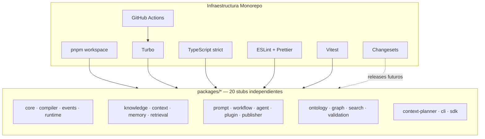

# PHASE_0_BOOTSTRAP_REPORT.md

## Atlas — Informe de Bootstrap del Monorepo (Phase 0)

**Fecha:** 18 de julio de 2026  
**Estado:** Completado — pendiente de validación  
**Autorización:** Phase 0 autorizada explícitamente por el owner  
**Próximo paso bloqueado:** `packages/core` — requiere nueva autorización

---

## 1. Resumen ejecutivo

Phase 0 transformó el repositorio Atlas de un **repositorio 100% documental** (47 specs Markdown, 0 archivos de código) en un **monorepo TypeScript profesional** con toolchain completa, CI y 20 paquetes stub listos para implementación.

**No se implementó ninguna funcionalidad de Atlas.**  
**No se modificó Foundation, Domain, Architecture, Engine ni SDK.**  
**No se escribió lógica de negocio, clases de dominio, Compiler, Runtime ni SDK funcional.**

El pipeline completo (`format:check → lint → typecheck → build → test`) **pasa en verde** en local.

---

## 2. Alcance ejecutado

### 2.1 Lo que SÍ se hizo (autorizado)

| # | Tarea autorizada | Estado |
|---|------------------|--------|
| 1 | Inicializar Git | ✅ |
| 2 | Crear estructura física ARCH-002 | ✅ |
| 3 | Configurar pnpm workspace | ✅ |
| 4 | Configurar Turbo | ✅ |
| 5 | Configurar TypeScript base | ✅ |
| 6 | Configurar ESLint | ✅ |
| 7 | Configurar Prettier | ✅ |
| 8 | Configurar Changesets | ✅ |
| 9 | Configurar Vitest | ✅ |
| 10 | Configurar GitHub Actions | ✅ |
| 11 | Crear package.json mínimos de todos los packages | ✅ |
| 12 | Configurar build vacío verificable | ✅ |

### 2.2 Lo que NO se hizo (por diseño)

| Restricción | Cumplida |
|-------------|----------|
| No implementar funcionalidad Atlas | ✅ |
| No implementar Compiler | ✅ |
| No implementar Runtime | ✅ |
| No implementar packages/core | ✅ |
| No implementar SDK funcional | ✅ |
| No crear clases de dominio | ✅ |
| No modificar specs oficiales | ✅ |
| No crear nuevas abstracciones arquitectónicas | ✅ |
| No crear commit (pendiente decisión del owner) | ✅ |

---

## 3. Estado antes vs. después

| Dimensión | Antes (Phase 0) | Después (Phase 0) |
|-----------|-----------------|-------------------|
| Archivos TypeScript | 0 | 62+ (stubs + configs) |
| Archivos JSON | 0 | 25+ |
| `packages/` | No existía | 20 paquetes |
| Git | No inicializado | Rama `main` |
| CI | No existía | GitHub Actions |
| Build | No existía | 20 paquetes compilan |
| Tests | No existían | 20 smoke tests |
| Dependencias npm | 0 | 276 paquetes (dev) |

---

## 4. Inventario de archivos de infraestructura creados

### 4.1 Raíz del monorepo

| Archivo | Función |
|---------|---------|
| `package.json` | Root del monorepo, scripts globales, devDependencies |
| `pnpm-workspace.yaml` | Define workspaces: `packages/*`, `apps/*`, `tools/*` |
| `pnpm-lock.yaml` | Lockfile generado por `pnpm install` |
| `turbo.json` | Pipeline Turbo: build, test, lint, typecheck |
| `tsconfig.base.json` | Configuración TypeScript compartida (strict) |
| `tsconfig.json` | Root TS config (referencias) |
| `eslint.config.js` | ESLint 9 flat config + typescript-eslint |
| `.prettierrc` | Reglas de formato |
| `.prettierignore` | Exclusiones de Prettier |
| `.gitignore` | Exclusiones Git |
| `.npmrc` | Config pnpm (engine-strict, peers) |
| `.nvmrc` | Node.js 20 |
| `.changeset/config.json` | Config Changesets |
| `.changeset/README.md` | Documentación Changesets |
| `.github/workflows/ci.yml` | Pipeline CI |

### 4.2 Directorios ARCH-002

| Directorio | Contenido actual |
|------------|------------------|
| `apps/` | README placeholder (sin apps implementadas) |
| `packages/` | 20 paquetes stub `@atlas/*` |
| `plugins/` | README placeholder |
| `docs/` | README índice → specs en raíz |
| `examples/` | README placeholder |
| `templates/` | README placeholder |
| `tests/` | README placeholder (tests cross-package futuros) |
| `tools/` | README placeholder |
| `scripts/` | `create-package-stubs.sh`, `vitest.package.config.ts`, README |

### 4.3 Scripts de mantenimiento

| Script | Propósito |
|--------|-----------|
| `scripts/create-package-stubs.sh` | Regenera stubs de paquetes (idempotente) |
| `scripts/vitest.package.config.ts` | Template de config Vitest por paquete |

---

## 5. Árbol completo del repositorio

```text
ATLAS/
├── .changeset/
│   ├── config.json
│   └── README.md
├── .github/
│   └── workflows/
│       └── ci.yml
├── .gitignore
├── .npmrc
├── .nvmrc
├── .prettierignore
├── .prettierrc
│
├── Foundation/                    # Spec — sin modificar
├── Architecture/                  # Spec — sin modificar
├── Domain/                        # Spec — sin modificar
├── Engine/                        # Spec — sin modificar
├── SDK/                           # Spec — sin modificar
│
├── apps/
│   └── README.md
├── packages/
│   ├── agent/
│   ├── cli/
│   ├── compiler/
│   ├── context/
│   ├── context-planner/
│   ├── core/
│   ├── events/
│   ├── graph/
│   ├── knowledge/
│   ├── memory/
│   ├── ontology/
│   ├── plugin/
│   ├── prompt/
│   ├── publisher/
│   ├── retrieval/
│   ├── runtime/
│   ├── sdk/
│   ├── search/
│   ├── validation/
│   └── workflow/
├── plugins/
│   └── README.md
├── docs/
│   └── README.md
├── examples/
│   └── README.md
├── templates/
│   └── README.md
├── tests/
│   └── README.md
├── tools/
│   └── README.md
├── scripts/
│   ├── create-package-stubs.sh
│   ├── vitest.package.config.ts
│   └── README.md
│
├── Agents/                        # Placeholder preexistente (vacío)
├── Brands/                        # Placeholder preexistente (vacío)
├── Knowlegde/                     # Placeholder preexistente (typo)
├── Organitation/                  # Placeholder preexistente (typo)
├── Workflows/                     # Placeholder preexistente (vacío)
│
├── IMPLEMENTATION_READINESS_REPORT.md
├── INFORME-REVISION-ARQUITECTONICA.md
├── PHASE_0_BOOTSTRAP_REPORT.md    # Este documento
│
├── eslint.config.js
├── package.json
├── pnpm-lock.yaml
├── pnpm-workspace.yaml
├── tsconfig.base.json
├── tsconfig.json
└── turbo.json
```

### 5.1 Layout interno de cada paquete (20 × idéntico)

```text
packages/<name>/
├── src/
│   ├── index.ts              # export {} — stub vacío
│   ├── contracts/.gitkeep
│   └── internal/.gitkeep
├── tests/
│   └── smoke.test.ts         # 1 test trivial de bootstrap
├── docs/.gitkeep
├── dist/                     # Generado por build (gitignored)
├── package.json
├── tsconfig.json
├── vitest.config.ts
├── README.md
└── CHANGELOG.md
```

---

## 6. Paquetes creados (20 stubs)

### 6.1 Grupo Phase 2 Kernel (13 paquetes)

Orden autorizado para implementación futura:

| # | Paquete | Nombre npm | Fuente |
|---|---------|------------|--------|
| 1 | core | `@atlas/core` | Phase 2 brief |
| 2 | compiler | `@atlas/compiler` | Phase 2 brief |
| 3 | events | `@atlas/events` | Phase 2 brief |
| 4 | runtime | `@atlas/runtime` | Phase 2 brief |
| 5 | knowledge | `@atlas/knowledge` | Phase 2 brief |
| 6 | context | `@atlas/context` | Phase 2 brief + DOM-003 |
| 7 | memory | `@atlas/memory` | Phase 2 brief + DOM-004 |
| 8 | retrieval | `@atlas/retrieval` | Phase 2 brief + DOM-005 |
| 9 | prompt | `@atlas/prompt` | Phase 2 brief + DOM-006 |
| 10 | workflow | `@atlas/workflow` | Phase 2 brief + DOM-007 |
| 11 | agent | `@atlas/agent` | Phase 2 brief + DOM-008 |
| 12 | plugin | `@atlas/plugin` | Phase 2 brief |
| 13 | publisher | `@atlas/publisher` | Phase 2 brief |

### 6.2 Grupo adicional (7 paquetes — definidos en specs)

| Paquete | Nombre npm | Fuente spec |
|---------|------------|-------------|
| ontology | `@atlas/ontology` | DOM-002 + ARCH-002 |
| graph | `@atlas/graph` | ARCH-002 + ARCH-004 |
| search | `@atlas/search` | Engine ATLAS-104 |
| validation | `@atlas/validation` | Engine ATLAS-109 |
| context-planner | `@atlas/context-planner` | Engine ATLAS-110 |
| cli | `@atlas/cli` | SDK-201 |
| sdk | `@atlas/sdk` | SDK-202 |

### 6.3 Paquetes NO creados (decisión documentada)

| Paquete | Motivo |
|---------|--------|
| `sdk-python` | SDK-203 es Python — fuera del workspace pnpm/TypeScript |
| `shared`, `types`, `errors` | ARCH-002 los lista como Foundation Packages; Phase 2 indica consolidación en `core` — pendiente decisión del owner |
| `rest`, `graphql`, `webhooks` | Solo ejemplos de categoría en ARCH-002, sin Implementation Mapping |
| `generators`, `storage`, `telemetry` | Solo ejemplos de categoría en ARCH-002 |

### 6.4 Dependencias entre paquetes

**Ninguna.** Todos los paquetes son independientes en Phase 0.  
No hay `"dependencies"` ni `"devDependencies"` entre `@atlas/*`.

---

## 7. Configuración de toolchain

### 7.1 pnpm

```yaml
# pnpm-workspace.yaml
packages:
  - 'packages/*'
  - 'apps/*'
  - 'tools/*'
```

| Decisión | Valor | Justificación |
|----------|-------|---------------|
| Gestor | pnpm 9.15.9 | Workspaces eficientes, estándar monorepo TS |
| Node mínimo | >=20.0.0 | LTS, alineado con `.nvmrc` |
| engine-strict | true | Consistencia de entorno |

### 7.2 Turbo

```json
{
  "tasks": {
    "build":   { "dependsOn": ["^build"], "outputs": ["dist/**"] },
    "test":    { "dependsOn": ["build"] },
    "lint":    { "dependsOn": ["^build"] },
    "typecheck": { "dependsOn": ["^build"] }
  }
}
```

| Decisión | Justificación |
|----------|---------------|
| Turbo 2.x | Cache incremental, orquestación multi-paquete |
| `^build` en lint/typecheck | Preparado para dependencias futuras entre paquetes |
| Outputs `dist/**` | Cache correcto de artefactos de build |

### 7.3 TypeScript

| Opción | Valor |
|--------|-------|
| target | ES2022 |
| module | NodeNext |
| moduleResolution | NodeNext |
| strict | true |
| noUncheckedIndexedAccess | true |
| noImplicitOverride | true |
| verbatimModuleSyntax | true |
| isolatedModules | true |

**Justificación:** TypeScript es el lenguaje implícito del Kernel según Domain Implementation Mappings y SDK-202. Modo strict desde el inicio evita deuda técnica.

### 7.4 Build (tsup)

Cada paquete usa:

```json
"build": "tsup src/index.ts --format esm --dts --clean --sourcemap"
```

| Decisión | Justificación |
|----------|---------------|
| tsup | Build mínimo ESM + `.d.ts` sin configuración pesada |
| ESM only | `"type": "module"` en todos los paquetes |
| sourcemap | Debugging en fases posteriores |

**Output por paquete:**

```text
dist/
├── index.js
├── index.js.map
├── index.d.ts
└── index.d.ts.map
```

### 7.5 ESLint

- ESLint 9 flat config (`eslint.config.js`)
- `@eslint/js` recommended
- `typescript-eslint` recommended
- `eslint-config-prettier` (sin conflictos con Prettier)
- `projectService: true` para type-aware linting

### 7.6 Prettier

```json
{
  "semi": true,
  "singleQuote": true,
  "trailingComma": "all",
  "printWidth": 100,
  "tabWidth": 2,
  "endOfLine": "lf"
}
```

### 7.7 Changesets

```json
{
  "access": "restricted",
  "baseBranch": "main",
  "commit": false,
  "updateInternalDependencies": "patch"
}
```

**Justificación:** ARCH-002 §13 exige Semantic Versioning. Changesets es el estándar para versionado multi-paquete en monorepos.

### 7.8 Vitest

Config **por paquete** (`packages/*/vitest.config.ts`):

```typescript
export default defineConfig({
  test: {
    include: ['tests/**/*.test.ts'],
    environment: 'node',
    passWithNoTests: false,
  },
});
```

**Nota técnica:** Se descartó un `vitest.config.ts` global con `include: packages/**/tests/**` porque Vitest lo heredaba al ejecutar desde cada paquete y no encontraba los tests locales. La config por paquete resuelve esto.

### 7.9 GitHub Actions

Pipeline `.github/workflows/ci.yml`:

```text
push/PR → main
  → checkout
  → pnpm (corepack)
  → node 20 (.nvmrc)
  → pnpm install --frozen-lockfile
  → pnpm format:check
  → pnpm lint
  → pnpm typecheck
  → pnpm build
  → pnpm test
```

---

## 8. Contenido de los stubs (sin lógica)

### 8.1 Entry point de cada paquete

```typescript
/**
 * @atlas/<name> — bootstrap stub
 * Implementation pending authorization.
 */
export {};
```

### 8.2 Smoke test de cada paquete

```typescript
import { describe, expect, it } from 'vitest';

describe('@atlas/<name>', () => {
  it('bootstrap stub is loadable', () => {
    expect(true).toBe(true);
  });
});
```

### 8.3 package.json template

Propiedades clave compartidas por los 20 paquetes:

| Campo | Valor |
|-------|-------|
| `name` | `@atlas/<name>` |
| `version` | `0.0.0` |
| `private` | `true` |
| `type` | `module` |
| `license` | `UNLICENSED` |
| `exports` | `./dist/index.js` + `./dist/index.d.ts` |
| `files` | `["dist"]` |

---

## 9. Scripts disponibles

| Comando | Acción |
|---------|--------|
| `pnpm build` | Compila los 20 paquetes via Turbo |
| `pnpm test` | Ejecuta 20 smoke tests via Turbo |
| `pnpm lint` | ESLint en src/ y tests/ de cada paquete |
| `pnpm typecheck` | `tsc --noEmit` en cada paquete |
| `pnpm format` | Prettier write en todo el repo |
| `pnpm format:check` | Prettier check (usado en CI) |
| `pnpm changeset` | Crear changeset para versionado |
| `pnpm version-packages` | Aplicar changesets |
| `pnpm release` | Build + publish (futuro) |

---

## 10. Verificación de pipeline

Ejecutado en local el 18/07/2026:

```bash
pnpm format:check   # ✅ PASS
pnpm lint           # ✅ PASS — 20 paquetes
pnpm typecheck      # ✅ PASS — 20 paquetes
pnpm build          # ✅ PASS — 20 paquetes → dist/
pnpm test           # ✅ PASS — 20 tests (1 por paquete)
```

**Resultado Turbo test:** `Tasks: 40 successful, 40 total` (20 build + 20 test)

---

## 11. Diagrama de dependencias

### 11.1 Estado actual (Phase 0)



**Sin flechas entre paquetes `@atlas/*` en Phase 0.**

### 11.2 Dependencias futuras (referencia, NO implementadas)

Según ARCH-002 §9 y readiness report — para implementación Phase 2:

```text
@atlas/core                    → (ninguna dependencia Atlas)
@atlas/compiler                → @atlas/core
@atlas/events                  → @atlas/core
@atlas/runtime                 → @atlas/core, @atlas/events
@atlas/knowledge               → @atlas/core
@atlas/context                 → @atlas/core
@atlas/memory                  → @atlas/core
@atlas/retrieval               → @atlas/core
@atlas/prompt                  → @atlas/core
@atlas/workflow                → @atlas/core, @atlas/events, @atlas/runtime
@atlas/agent                   → @atlas/core, @atlas/runtime, @atlas/prompt
@atlas/plugin                  → @atlas/core
@atlas/publisher               → @atlas/core, @atlas/compiler
```

---

## 12. Git

| Propiedad | Valor |
|-----------|-------|
| Inicializado | Sí |
| Rama default | `main` |
| Commits | 0 (sin commit inicial — pendiente decisión del owner) |
| `.gitignore` | node_modules, dist, .turbo, coverage, .env, .DS_Store |

---

## 13. Decisiones técnicas tomadas (para revisión)

| # | Decisión | Alternativas descartadas | Riesgo |
|---|----------|--------------------------|--------|
| D1 | tsup para build | tsc project references, unbuild | Bajo — fácil migrar si se necesita |
| D2 | ESLint flat config (v9) | ESLint legacy .eslintrc | Bajo — estándar actual |
| D3 | Vitest config por paquete | Config global con projects | Resuelto — tests funcionan |
| D4 | 20 paquetes stub vs solo 13 Phase 2 | Solo Kernel | Medio — incluye paquetes de specs adicionales |
| D5 | Specs permanecen en raíz | Mover a docs/ | Bajo — evita romper referencias |
| D6 | Renombrar `Apps/` → `apps/` | Mantener capitalización | Resuelto — compatibilidad Linux/CI |
| D7 | `license: UNLICENSED` en stubs | MIT, Apache | Medio — pendiente decisión legal |
| D8 | Sin dependencias inter-paquete | Wire mínimo | Correcto — Phase 0 puro |

---

## 14. Inconsistencias spec pendientes (NO resueltas)

Reportadas para decisión del owner — **no bloquean Phase 0**, sí afectan implementación futura:

| ID | Inconsistencia | Impacto |
|----|----------------|---------|
| S1 | Engine `search` tiene paquete stub pero no está en orden Phase 2 (13) | ¿Implementar como módulo de retrieval o paquete separado? |
| S2 | Engine `validation` — mismo caso | ¿Paquete separado o parte de compiler? |
| S3 | Engine `context-planner` — mismo caso | ¿Paquete separado o parte de context? |
| S4 | `graph`, `ontology` en ARCH-002 pero no en Phase 2 order | ¿Cuándo implementar? |
| S5 | ARCH-002 Foundation `shared/types/errors` vs `packages/core` único | ¿Scope de core? |
| S6 | `plugins/` raíz vs `packages/plugin` del Kernel | Roles distintos — confirmar |

---

## 15. Checklist de validación para el ingeniero

### 15.1 Infraestructura

```text
□ Verificar que Git está inicializado en rama main
□ Ejecutar: pnpm install
□ Ejecutar: pnpm format:check && pnpm lint && pnpm typecheck && pnpm build && pnpm test
□ Confirmar 20 paquetes en packages/
□ Confirmar estructura ARCH-002 (apps, packages, plugins, docs, examples, templates, tests, tools, scripts, .github)
□ Revisar .github/workflows/ci.yml
□ Revisar tsconfig.base.json (strict mode)
□ Revisar turbo.json pipeline
```

### 15.2 Stubs

```text
□ Confirmar que src/index.ts de cada paquete es export {} sin lógica
□ Confirmar que no hay dependencias @atlas/* entre paquetes
□ Confirmar layout src/contracts/, src/internal/ presente
□ Confirmar naming @atlas/<package> en todos los package.json
```

### 15.3 Specs

```text
□ Confirmar que Foundation/ no fue modificado
□ Confirmar que Domain/ no fue modificado
□ Confirmar que SDK/ no fue modificado
□ Confirmar que Engine/ no fue modificado
□ Confirmar que Architecture/ no fue modificado
```

### 15.4 Decisiones pendientes de aprobar

```text
□ Aprobar lista de 20 paquetes stub (vs solo 13 Phase 2)
□ Aprobar scope futuro de @atlas/core (shared/types/errors)
□ Aprobar resolución de inconsistencias S1–S6
□ Aprobar commit inicial de Phase 0
□ Autorizar inicio de packages/core
```

---

## 16. Cómo reproducir localmente

```bash
# Requisitos
node --version    # >= 20
pnpm --version    # >= 9

# Setup
cd ATLAS
pnpm install

# Verificación completa
pnpm format:check
pnpm lint
pnpm typecheck
pnpm build
pnpm test
```

**Resultado esperado:** Todos los comandos exit code 0.  
**Artefactos generados:** `packages/*/dist/` (gitignored)

---

## 17. Próximos pasos (bloqueados hasta autorización)

| Paso | Requiere |
|------|----------|
| Commit inicial Phase 0 | Decisión del owner |
| Implementar `@atlas/core` | Autorización explícita post-revisión |
| Wire dependencias inter-paquete | Contratos publicados en core |
| Resolver S1–S6 | Decisión arquitectónica del owner |
| Push a remote + activar CI | Remote configurado |

---

## 18. Conclusión

Phase 0 cumplió su objetivo: **transformar el repositorio documental en un monorepo profesional listo para implementar el Kernel**, sin escribir lógica de negocio ni desviarse de las especificaciones oficiales.

| Criterio | Cumplido |
|----------|----------|
| Infraestructura completa | ✅ |
| 20 paquetes stub compilables | ✅ |
| Pipeline verde en local | ✅ |
| Specs intactas | ✅ |
| Sin lógica Atlas | ✅ |
| Listo para revisión técnica | ✅ |
| Listo para `packages/core` | ⏳ Pendiente autorización |

---

## Apéndice A — Dependencias dev instaladas (root)

| Paquete | Versión instalada |
|---------|-------------------|
| @changesets/cli | 2.31.1 |
| @eslint/js | 9.39.5 |
| @types/node | 22.20.1 |
| eslint | 9.39.5 |
| eslint-config-prettier | 10.1.8 |
| prettier | 3.9.5 |
| tsup | 8.5.1 |
| turbo | 2.10.5 |
| typescript | 5.9.3 |
| typescript-eslint | 8.64.0 |
| vitest | 3.2.7 |

---

## Apéndice B — Referencias

- `IMPLEMENTATION_READINESS_REPORT.md` — Audit pre-Phase 0
- `Architecture/ATLAS-ARCH-002 — PACKAGE_ARCHITECTURE.md` — Fuente de verdad estructural
- `Foundation/ATLAS-000-README.md` — Organización del proyecto

---

| Version | Date | Description |
|---------|------|-------------|
| 1.0.0 | 2026-07-18 | Informe completo de Phase 0 bootstrap |
