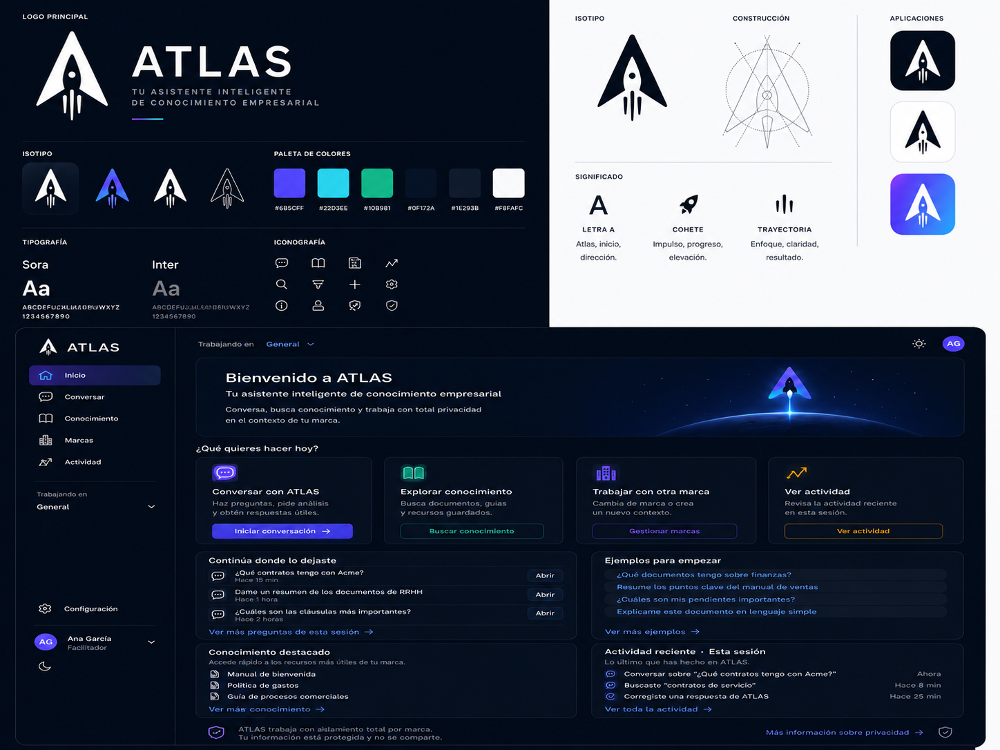

<p align="center">
  
</p>

<h1 align="center">ATLAS</h1>

<p align="center">
  <strong>Tu asistente inteligente de conocimiento empresarial</strong><br />
  <em>Preservamos el conocimiento. Amplificamos el criterio. Escalamos la inteligencia.</em>
</p>

<p align="center">
  <code>0.1.0-alpha</code> · Kernel <code>0.1</code> congelado · Web UI P2.5 entregada · Fase 2 — Producto
</p>

<p align="center">
  <a href="./VERSION.md">VERSION.md</a> ·
  <a href="./ATLAS_PRODUCT_VISION_v1.0.md">Visión de producto</a> ·
  <a href="./ATLAS_ARCHITECTURE_MASTER.md">Arquitectura</a> ·
  <a href="./USER_MANUAL.md">Manual de usuario</a>
</p>

---

## Qué es ATLAS

**ATLAS** es una plataforma de ingeniería del conocimiento para pymes y equipos que operan **varias marcas en paralelo**. Modela, compila y ejecuta conocimiento organizacional como infraestructura — no como prompts efímeros.

| Superficie | Para quién | Cómo se usa |
|------------|------------|-------------|
| **ATLAS Web** | Uso diario, negocio | Navegador — conversación, marcas, conocimiento, actividad |
| **CLI (`atlas`)** | Desarrollo, operación técnica | Terminal — memory, plan, chat, compile, doctor |
| **Kernel (`@atlas/*`)** | Ingeniería de plataforma | SDK, runtime, compiler — base congelada v0.1 |

> **CLI = herramienta técnica** · **Web = producto**

Filosofía de diseño: *Make the complex feel simple.*

---

## ATLAS Web

Interfaz principal de producto en `apps/web/` — sidebar-first, español nativo, contexto aislado por **marca**.

| Ruta | Función |
|------|---------|
| `/` | Inicio — acciones rápidas y actividad de sesión |
| `/chat` | Conversación con ATLAS |
| `/conocimiento` | Buscar y explorar conocimiento |
| `/marcas` | Gestionar marcas de trabajo |
| `/actividad` | Timeline de la sesión actual |

```bash
pnpm install && pnpm build
pnpm atlas web
# → http://127.0.0.1:4173
```

Requiere `ATLAS_LLM_API_KEY` (y proveedor/modelo) en `.env` para respuestas generativas. Ver [`USER_MANUAL.md`](./USER_MANUAL.md).

**Estado Web UI:** Fases 3A–3I completadas — design system integrado, accesibilidad WCAG P0/P1, selector light/dark, piloto listo.  
**Tests `@atlas/web`:** 147/147 · Informes en [`releases/`](./releases/).

Documentación UX: [`docs/WEB_UI_PRODUCT_UX.md`](./docs/WEB_UI_PRODUCT_UX.md)

---

## Design System

El sistema visual vive en [`apps/web/design-system/`](./apps/web/design-system/) e impregna la Web UI vía tokens en `apps/web/src/client/styles/`.

<p align="center">
  
</p>

### Marca

| Regla | Detalle |
|-------|---------|
| **Isotipo** | Geometría **inmutable** — A + cohete + trayectoria ([`assets/logo.svg`](./apps/web/design-system/assets/logo.svg)) |
| **Recoloración** | Solo filtros/CSS sobre el SVG negro; nunca redibujar |
| **Dark** | Isotipo claro sobre superficies navy |
| **Light** | Isotipo púrpura marca `#685CFF` sobre fondos claros |

### Paleta

| Token | Hex | Uso |
|-------|-----|-----|
| `--color-primary` | `#685CFF` | Acción primaria, marca |
| `--color-cyan` | `#22D3EE` | Conocimiento, foco, información |
| `--color-bg` | `#0F172A` | Fondo dark (navy profundo) |
| `--color-surface` | `#111C31` | Superficies dark |
| `--color-success` | `#10B981` | Éxito |
| `--color-warning` | `#F59E0B` | Actividad / atención |
| `--color-error` | `#F43F5E` | Error |

Tema claro: `#F8FAFC` / `#FFFFFF` — misma app, otra luz. Toggle en header de la Web UI.

Referencia completa: [`apps/web/design-system/tokens/colors.css`](./apps/web/design-system/tokens/colors.css) · [`colores-atlas.png`](./apps/web/design-system/assets/reference/colores-atlas.png)

### Tipografía

| Rol | Familia | Uso |
|-----|---------|-----|
| **Display** | [Sora](https://fonts.google.com/specimen/Sora) | Títulos, hero, logo wordmark |
| **UI** | [Inter](https://fonts.google.com/specimen/Inter) | Cuerpo, navegación, formularios |

Iconografía: **Lucide** (trazo geométrico 1.75px) — ver [`apps/web/src/client/lib/icons.ts`](./apps/web/src/client/lib/icons.ts).

### Componentes

34 componentes React de referencia + UI kit clicable en `ui_kits/atlas-web/`. Guía completa: [`apps/web/design-system/readme.md`](./apps/web/design-system/readme.md).

---

## Inicio rápido

### Requisitos

- Node.js ≥ 20  
- pnpm ≥ 9  

### Instalación

```bash
git clone https://github.com/luispalaciosec/proyecto-ATLAS.git ATLAS
cd ATLAS
pnpm install
pnpm build
pnpm atlas doctor
```

### Comandos habituales

```bash
pnpm atlas web          # Interfaz web local
pnpm atlas chat         # Conversación en terminal
pnpm atlas ask --goal "…"
pnpm atlas memory search --query "…"
pnpm atlas brand geeks  # Contexto por marca
pnpm atlas doctor       # Diagnóstico del entorno
```

### LLM (P2.1)

| Proveedor | `ATLAS_LLM_PROVIDER` |
|-----------|----------------------|
| Anthropic | `anthropic` (default) |
| OpenAI-compatible (p. ej. Qwen) | `openai-compatible` |

```bash
export ATLAS_LLM_API_KEY="..."
export ATLAS_LLM_MODEL="..."
# Opcional: ATLAS_LLM_BASE_URL para endpoints compatibles OpenAI
```

Nunca commitear claves. `.env` está en `.gitignore`.

### Quality gate

```bash
pnpm format:check && pnpm lint && pnpm typecheck && pnpm build && pnpm test
pnpm atlas doctor
```

---

## Arquitectura (Kernel)

```text
Developer
    │
    ▼
@atlas/cli          ← Interfaz humana (solo @atlas/sdk)
    │
    ▼
@atlas/sdk           ← API pública del Kernel
    │
    ├── @atlas/compiler
    ├── @atlas/runtime
    ├── @atlas/events
    ├── @atlas/memory / @atlas/retrieval / @atlas/intelligence …
    └── @atlas/core
```

**Grafo sin ciclos:** `core → events → compiler → runtime → sdk (+ capabilities) → cli`

Especificaciones: [`spec/`](./spec/) · ADRs: [`adr/`](./adr/) · Release Kernel: [`releases/ATLAS-RELEASE-001-KERNEL_v0.1.md`](./releases/ATLAS-RELEASE-001-KERNEL_v0.1.md)

---

## Estructura del repositorio

```text
ATLAS/
├── apps/
│   └── web/                    # ATLAS Web + Design System
│       ├── design-system/      # Tokens, componentes, guías de marca
│       └── src/                # Cliente SPA + servidor HTTP
├── packages/                   # @atlas/* — Kernel y capabilities
├── spec/                       # Especificaciones normativas
├── releases/                   # Informes de fase, auditorías, releases
├── docs/                       # Guías humanas
├── workspaces/                 # Proyectos Atlas de referencia
├── examples/                   # Demos técnicas
└── adr/                        # Architecture Decision Records
```

---

## Roadmap (resumen)

| Fase | Estado | Contenido |
|------|--------|-----------|
| **Architecture + Kernel v0.1** | ✅ | Specs, ADRs, platform congelada |
| **Stage 2 — Capabilities** | ✅ | Memory, Retrieval, Knowledge, Workflow, Planning, LLM |
| **P2.5 — Web UI** | ✅ | Producto navegable, marcas, accesibilidad 3I |
| **Piloto de uso real** | 🎯 **Actual** | Varias semanas, ≥1 marca real |
| **P2.6 — Cloud** | ⏸ Condicional | Solo si el piloto lo exige |

Detalle: [`VERSION.md`](./VERSION.md) · [`ATLAS_PRODUCT_VISION_v1.0.md`](./ATLAS_PRODUCT_VISION_v1.0.md)

---

## Documentación

| Documento | Descripción |
|-----------|-------------|
| [`USER_MANUAL.md`](./USER_MANUAL.md) | Uso diario — CLI y Web |
| [`docs/README.md`](./docs/README.md) | Índice de guías e informes de fase |
| [`releases/ATLAS_PILOT_PROTOCOL.md`](./releases/ATLAS_PILOT_PROTOCOL.md) | Protocolo de piloto |
| [`docs/guides/VERIFICATION_PLAYBOOK.md`](./docs/guides/VERIFICATION_PLAYBOOK.md) | Casos de verificación manual |

---

## Licencia

Consultar el repositorio para los términos de licencia aplicables.
